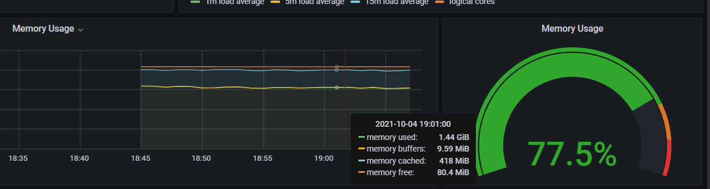

# Cluster Monitoring and Init Containers

## Kube Prometheus Stack

### Stack components

- [**Prometheus Operator**](https://github.com/prometheus-operator/prometheus-operator): A plugin for Kubernetes that makes it easier to integrate Prometheus into our Kubernetes stack. It includes features like Custom Resources and Simplified Deployment Configuration that help simplify and automate the configuration of the Prometheus stack in a Kubernetes cluster.
- [**Prometheus**](https://prometheus.io/): A monitoring system used for collecting and visualizing metrics from applications and storing them in a time-series database that can then be used by tools like Grafana and Loki for logs aggregation and visualization.
- [**Prometheus Alertmanager**](https://github.com/prometheus/alertmanager): A service for handling and processing alerts sent by applications like Prometheus and forwarding them.
- [**Prometheus Node-exporter**](https://github.com/prometheus/node_exporter): A tool for collecting and exposing metrics about the node on which it runs. It is mainly used for exporting hardware-related metrics like CPU, memory, disk, network and more, as well as kernel information.
- [**Prometheus Adapter for Kubernetes Metrics APIs**](https://github.com/kubernetes-sigs/prometheus-adapter): Helps connect between Prometheus and Kubernetes by collecting metrics from Kubernetes APIs (such as information about pods, resources, and nodes) and publishing them in the Prometheus way.
- [**kube-state-metrics**](https://github.com/kubernetes/kube-state-metrics): Similar to the adapter above, but without outputting in the Prometheus way; just raw data and metrics in plain text.
- [**Prometheus Grafana**](https://grafana.com/): A web-based application for visualizing and exploring metrics.

### Command outputs

- After installing the stack and my application. The command gets information about **po**ds, **st**ateful**s**ets, **s**er**v**i**c**es, **p**ersistent **v**olume **c**laims, and **c**onfig **m**aps.

```powershell
PS C:\Users\aabou> kubectl get po,sts,svc,pvc,cm
NAME                                                         READY   STATUS    RESTARTS   AGE
pod/alertmanager-app-python-kube-prometheus-alertmanager-0   2/2     Running   0          2m16s
pod/app-python-0                                             1/1     Running   0          2m58s
pod/app-python-1                                             1/1     Running   0          2m58s
pod/app-python-2                                             1/1     Running   0          2m58s
pod/app-python-grafana-7cd494d5c-hfxmm                       2/2     Running   0          2m59s
pod/app-python-kube-prometheus-operator-69d5747c57-m9kf4     1/1     Running   0          2m59s
pod/app-python-kube-state-metrics-7cfc4788f4-d24gw           1/1     Running   0          2m59s
pod/app-python-prometheus-node-exporter-w8dtj                1/1     Running   0          2m59s
pod/prometheus-app-python-kube-prometheus-prometheus-0       2/2     Running   0          2m15s

NAME                                                                    READY   AGE
statefulset.apps/alertmanager-app-python-kube-prometheus-alertmanager   1/1     2m17s
statefulset.apps/app-python                                             3/3     2m59s
statefulset.apps/prometheus-app-python-kube-prometheus-prometheus       1/1     2m15s

NAME                                              TYPE           CLUSTER-IP       EXTERNAL-IP   PORT(S)                      AGE
service/alertmanager-operated                     ClusterIP      None             <none>        9093/TCP,9094/TCP,9094/UDP   2m17s
service/app-python                                LoadBalancer   10.110.242.50    <pending>     5000:32177/TCP               3m
service/app-python-grafana                        ClusterIP      10.103.82.63     <none>        80/TCP                       3m
service/app-python-kube-prometheus-alertmanager   ClusterIP      10.108.118.135   <none>        9093/TCP                     3m
service/app-python-kube-prometheus-operator       ClusterIP      10.102.62.15     <none>        443/TCP                      3m
service/app-python-kube-prometheus-prometheus     ClusterIP      10.106.76.57     <none>        9090/TCP                     2m59s
service/app-python-kube-state-metrics             ClusterIP      10.98.84.38      <none>        8080/TCP                     3m
service/app-python-prometheus-node-exporter       ClusterIP      10.100.197.3     <none>        9100/TCP                     3m
service/kubernetes                                ClusterIP      10.96.0.1        <none>        443/TCP                      13d
service/prometheus-operated                       ClusterIP      None             <none>        9090/TCP                     2m15s

NAME                                        STATUS   VOLUME                                     CAPACITY   ACCESS MODES   STORAGECLASS   AGE
persistentvolumeclaim/visits-app-python-0   Bound    pvc-3118250a-f2a7-46ba-801e-9be5165c0d1a   256M       RWO            standard       5h23m
persistentvolumeclaim/visits-app-python-1   Bound    pvc-60d05024-1fc0-4a88-8b32-c6e2ca041d88   256M       RWO            standard       5h23m
persistentvolumeclaim/visits-app-python-2   Bound    pvc-0dd7e8f6-90b9-4a2a-b26c-397dd9f110b8   256M       RWO            standard       5h23m

NAME                                                                     DATA   AGE
configmap/app-python-configmap                                           1      3m2s
configmap/app-python-grafana                                             1      3m2s
configmap/app-python-grafana-config-dashboards                           1      3m2s
configmap/app-python-grafana-test                                        1      3m2s
configmap/app-python-kube-prometheus-alertmanager-overview               1      3m2s
configmap/app-python-kube-prometheus-apiserver                           1      3m2s
configmap/app-python-kube-prometheus-cluster-total                       1      3m2s
configmap/app-python-kube-prometheus-controller-manager                  1      3m1s
configmap/app-python-kube-prometheus-etcd                                1      3m1s
configmap/app-python-kube-prometheus-grafana-datasource                  1      3m1s
configmap/app-python-kube-prometheus-k8s-coredns                         1      3m1s
configmap/app-python-kube-prometheus-k8s-resources-cluster               1      3m1s
configmap/app-python-kube-prometheus-k8s-resources-namespace             1      3m1s
configmap/app-python-kube-prometheus-k8s-resources-node                  1      3m1s
configmap/app-python-kube-prometheus-k8s-resources-pod                   1      3m1s
configmap/app-python-kube-prometheus-k8s-resources-workload              1      3m1s
configmap/app-python-kube-prometheus-k8s-resources-workloads-namespace   1      3m1s
configmap/app-python-kube-prometheus-kubelet                             1      3m1s
configmap/app-python-kube-prometheus-namespace-by-pod                    1      3m1s
configmap/app-python-kube-prometheus-namespace-by-workload               1      3m2s
configmap/app-python-kube-prometheus-node-cluster-rsrc-use               1      3m1s
configmap/app-python-kube-prometheus-node-rsrc-use                       1      3m1s
configmap/app-python-kube-prometheus-nodes                               1      3m2s
configmap/app-python-kube-prometheus-persistentvolumesusage              1      3m2s
configmap/app-python-kube-prometheus-pod-total                           1      3m1s
configmap/app-python-kube-prometheus-prometheus                          1      3m1s
configmap/app-python-kube-prometheus-proxy                               1      3m2s
configmap/app-python-kube-prometheus-scheduler                           1      3m1s
configmap/app-python-kube-prometheus-statefulset                         1      3m1s
configmap/app-python-kube-prometheus-workload-total                      1      3m1s
configmap/kube-root-ca.crt                                               1      13d
configmap/prometheus-app-python-kube-prometheus-prometheus-rulefiles-0   28     2m15s
```

### Collected metrics

- CPU and Memory usage of the StatefulSet:
  My StatefulSet is using around `1%` of the CPU and `135 MiB` of memory.
  
- Max and min CPU usages:
  The pod using the maximum CPU is `prometheus-app-python-kube-prometheus-prometheus-0`, and the one using the minimum CPU is `app-python`.
  
  
- Total memory used:
  77.5% (1.44 GiB).
  
- Pods and containers running by the Kubelet service:
  18 pods and 33 containers.
  
- Max and min pod network usage:
  The pod using the maximum network is `prometheus-app-python-kube-prometheus-prometheus-0`, and the one using the minimum network bandwidth is `app-python`.
  
  
- Number of alerts:
  9
  
